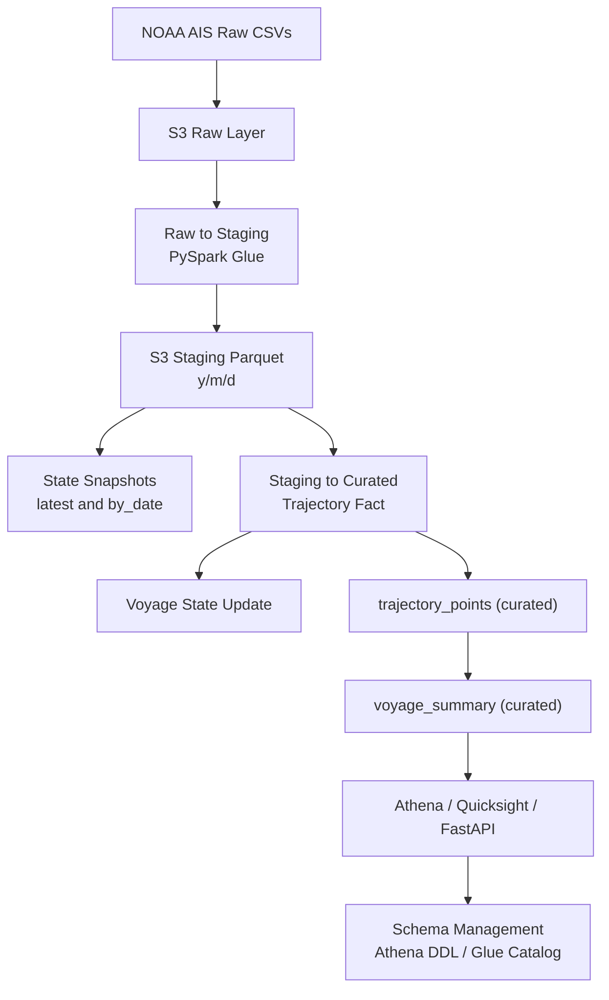
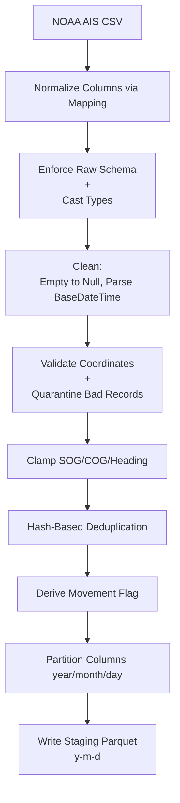
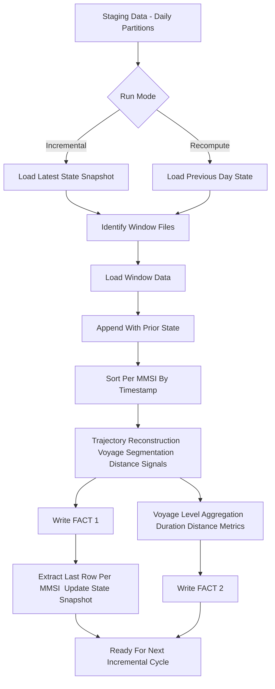

# **NOAA AIS Data Pipeline**

PySpark and AWS Glue pipeline processing **~4.5 billion rows (~455 GB)** of AIS vessel tracking data from NOAA. Ingests daily and backfill drops from U.S. waters and delivers analytics-ready Parquet in Amazon S3, optimized for **downstream analytics** and **API integration** without double-counting across incremental runs.

---

## **Overview**

End-to-end data engineering workflow for high-volume geospatial AIS. The pipeline standardizes schema, cleans and quarantines bad records, deduplicates via content hashing, enriches with voyage segmentation and spatial features, and serves curated datasets for Athena, BI, and API consumers. Built for Glue 4.0 (Spark 3.5) with modular utilities and unit-tested transforms.

---

## **Architecture**

---

### **Raw -> Staging Flow**

---

### **Staging -> Curated Incremental Flow**

---

## **Key Features**

* Processes > 450 GB (2024 + 2025) of AIS data with distributed PySpark jobs on Glue.
* Modular three-stage pipeline: **Raw -> Staging -> Curated** with stateful incremental/recompute to avoid double-counting.
* Cleansing: column normalization, schema enforcement, empty-to-null, coordinate validation with quarantine, SOG/COG/Heading clamping, hash-based deduplication, movement flagging.
* Curated facts: voyage segmentation (3h gap rule), haversine segment distance, geohash indexing, spatial grid options, voyage summaries.
* Dimensions: country (MID + call sign), navigational status, vessel type from S3 lookups.
* Testing: PySpark unit and integration coverage for transformations and schemas.
* Built for downstream analytics, BI, and backend/API integration.

---

## **Repository Structure**

- [noaa-ais-pipeline/](./)  
  - [pipelines/](./pipelines) -> Pipeline scripts  
    - [raw_to_staging.py](./pipelines/raw_to_staging.py) -> Ingests raw NOAA AIS CSVs into the staging layer  
    - [staging_to_curated.py](./pipelines/staging_to_curated.py) -> Cleans, enriches, and prepares curated datasets (trajectory + summary, state-aware incremental)  
    - [dim_loader.py](./pipelines/dim_loader.py) -> Builds Country, Nav Status, Vessel Type dimensions from lookup Excel files  
  - [transformations/](./transformations) -> Transformation modules  
    - [facts/](./transformations/facts) -> Fact table build scripts  
      - [fact_voyage_trajectory.py](./transformations/facts/fact_voyage_trajectory.py) -> Seeded voyage segmentation, distance, geohash, movement state  
      - [fact_voyage_summary.py](./transformations/facts/fact_voyage_summary.py) -> Voyage-level rollups  
    - [dims/](./transformations/dims) -> Dimension table build scripts  
    - [notebooks/](./transformations/notebooks) -> Transformation notebooks for debugging and exploration  
  - [views/](./views)  
    - [view_definitions.sql](./views/view_definitions.sql) -> Reusable analytical and Power BI view definitions  
  - [athena_ddl_scripts/](./athena_ddl_scripts)  
    - Athena DDL scripts for curated and analytics tables  
  - [utils/](./utils) -> Utility scripts  
    - [schema_definitions.py](./utils/schema_definitions.py) -> Centralized table schema definitions  
    - [column_mapping.py](./utils/column_mapping.py) -> Column normalization map for raw ingestion  
    - [config.py](./utils/config.py) -> Configuration management and environment setup (s3a-safe)  
    - [common_functions_raw.py](./utils/common_functions_raw.py) -> Raw-layer cleansing helpers  
    - [common_functions_curated.py](./utils/common_functions_curated.py) -> Curated-layer helpers (geohash, haversine, voyage segmentation)  
    - [state_io.py](./utils/state_io.py) -> Incremental state read/write helpers  
  - [assets/](./assets) -> Diagrams and supporting artifacts  
  - [data/](./data) -> Sample and mock datasets for local testing  
  - [ingestion/](./ingestion) -> Shell scripts to pull NOAA drops to S3 (`ingest_2024.sh`, `ingest_2025.sh`)  
  - [docs/](./docs) -> Ingestion guide, Glue orchestration, postmortem, Glacier report, incremental/recompute model  
  - [tests/](./tests) -> Unit and schema validation tests  
    - [unit/](./tests/unit) -> Cleaning, parsing, dedup, schema utilities  
    - [integration/](./tests/integration) -> Slice integration test  
  - [requirements.txt](./requirements.txt) -> Python dependencies for the pipeline  
  - [README.md](./README.md) -> Project documentation  

---

## **Technologies Used**

* **PySpark / AWS Glue** - distributed data transformation  
* **Amazon S3** - data lake storage (raw, staging, curated)  
* **Amazon Athena** - external table creation and query validation on raw/staging partitions  
* **AWS CloudShell** - ingestion automation from NOAA source  
* **Python 3.10+** - core scripting and orchestration  
* **pytest / PySpark testing framework** - validation and unit testing  

---

## **Data Source**

AIS vessel position data provided by NOAA’s Office for Coastal Management

* [2024 Files (zip file size - 116.7 GB, csv file size - 319.5 GB)](https://coast.noaa.gov/htdata/CMSP/AISDataHandler/2024)  
* [2025 Files (zip file size - 38.6 GB, csv file size - 136.1 GB)](https://coast.noaa.gov/htdata/CMSP/AISDataHandler/2025)

---

## **Lookup Tables**  

| Lookup Type | Description | Dataset Link |
|--------------|--------------|----------------|
| **Maritime Identification Digits (MID)** | Unique 3-digit codes assigned to each country to identify vessels' origin during radio communication. | [ITU MID Table](https://www.itu.int/en/ITU-R/terrestrial/fmd/Pages/mid.aspx) |
| **International Call Sign Series** | Allocated call sign prefixes used to identify a vessel's registered country or licensing authority. | [ITU Call Sign Series](https://www.itu.int/en/ITU-R/terrestrial/fmd/Pages/call_sign_series.aspx) |
| **Vessel Type Codes** | Classification of vessel types used in AIS data for analytics and categorization. | [NOAA Vessel Type Codes (PDF)](https://coast.noaa.gov/data/marinecadastre/ais/VesselTypeCodes2018.pdf) |
| **AIS Navigational Status Codes** | Describes the real-time navigational state of a vessel (e.g., underway, at anchor, aground). | [Datalastic AIS Status Codes](https://datalastic.com/blog/ais-navigational-status/) |

---

## **Runbook (Glue 4.0)**

- Raw -> Staging:  
  `aws glue start-job-run --job-name noaa-ais-raw-to-staging --arguments mode=incremental,start_date=2025-01-01,end_date=2025-01-02`  
  
  `mode=full` ingests all available partitions.

- Staging -> Curated:  
  `aws glue start-job-run --job-name noaa-ais-staging-to-curated --arguments mode=incremental,start_date=2025-01-01,end_date=2025-01-02`  
  
  `mode=recompute` seeds from `state/by_date=YYYY-MM-DD/` instead of `state/latest` for backfills without state drift.

- Dimensions:  
  `aws glue start-job-run --job-name noaa-ais-dim-loader`

- Local Spark dry-run (functional validation):  
  `spark-submit pipelines/raw_to_staging.py --JOB_NAME local --mode incremental --start_date 2025-01-01 --end_date 2025-01-01`  
  
  `spark-submit pipelines/staging_to_curated.py --JOB_NAME local --mode incremental --start_date 2025-01-01 --end_date 2025-01-01`

---

## **Configuration**

All S3 paths auto-normalize to `s3a://` in `utils/config.py`. 

Environment overrides: `S3_RAW_PATH`, `S3_STAGING_PATH`, `S3_CURATED_PATH`, `S3_LOOKUP_PATH`, `GLUE_DATABASE`, `GLUE_TEMP_DIR`, `GLUE_ROLE_NAME`, `AWS_REGION`, `DEFAULT_MODE`, `DEFAULT_DATE`.

---

## **Data Quality & Observability**

* Schema enforcement per layer (`utils/schema_definitions.py`) and column normalization (`utils/column_mapping.py`).  
* Quarantine writes for invalid lat/lon under `<S3_STAGING_PATH>/quarantine/` with partition-aware paths.  
* Dedup via 256-bit hash of all business columns prevents replay duplicates.  
* Glue-safe logging (`utils/config.setup_logger`) writes to `/tmp/logs` and stdout; curated facts log row/MMSI checkpoints.  

---

## **Testing**

* Unit tests: `tests/unit/` and `tests/test_schemas.py` for cleaning, parsing, dedup, schema expectations.  
* Integration: `tests/integration/test_integration_pipeline.py` slice test across transforms.  
* Run locally: `pytest -q` (requires Spark test fixtures).  

---

## **Future Work**

* Real-time streaming integration (Kafka or Kinesis)  
* Enrichment with external vessel registries (IMO, Equasis)  
* FastAPI-based analytics API and React/PowerBI dashboard  
* CI/CD integration for automated testing and deployment  

---

## **Author**

Developed by **Siva Prasath** as a large-scale data engineering and analytics project showcasing **ETL architecture, PySpark optimization, AWS data lake design, and engineering-grade testing practices**.

---

© 2025 NOAA AIS Pipeline Project by Siva Prasath. All rights reserved.
