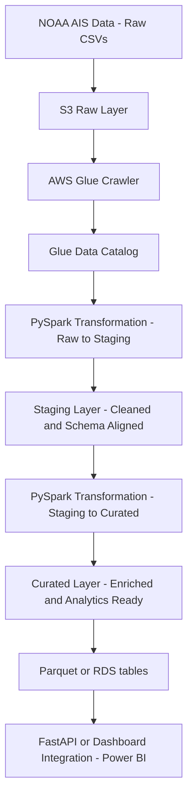

# **NOAA AIS Data Pipeline**

PySpark and AWS Glue pipeline processing **~4.5 billion rows (~455 GB)** of vessel tracking data from the **National Oceanic and Atmospheric Administration (NOAA)** via the **Automatic Identification System (AIS)**. Handles continuous AIS feeds from U.S. waters to produce analytics-ready datasets in **Amazon S3** for large-scale maritime intelligence and backend **API integration**.

---

## **Overview**

This project implements a complete **data engineering workflow** to process **high-volume geospatial AIS (Automatic Identification System) maritime data**. The pipeline ingests daily AIS files from NOAA’s public repository, performs schema standardization, geospatial transformations, and builds curated and analytical datasets optimized for downstream analytics and visualization.

The system is designed for scalability, modularity, testability, and cost-efficiency using AWS native services.

---

## **Architecture**

**Data Flow:**

---

## **Key Features**

* Processes > 450 GB(2024 and 2025) of AIS vessel data efficiently using distributed PySpark jobs.
* Modular three-stage pipeline: **Raw → Staging → Curated**.
* Integrates lookup mappings for vessel type, cargo, and transceiver classification.
* Produces analytics-ready Parquet datasets for querying and visualization.
* Implements **unit testing** for PySpark transformations to ensure data integrity and maintainability.
* Ready for integration with **FastAPI** or BI dashboards (React / PowerBI).

---

## **Repository Structure**

- [noaa-ais-pipeline/](./)  
  - [pipelines/](./pipelines) → Pipeline scripts  
    - [raw_to_staging.py](./pipelines/raw_to_staging.py) → Ingests raw NOAA AIS CSVs into the staging layer  
    - [staging_to_curated.py](./pipelines/staging_to_curated.py) → Cleans, enriches, and prepares curated datasets  
  - [transformations/](./transformations) → Transformation modules  
    - [facts/](./transformations/facts) → Fact table build scripts  
    - [dims/](./transformations/dims) → Dimension table build scripts  
    - [notebooks/](./transformations/notebooks) → Transformation notebooks for debugging and exploration  
  - [views/](./views)  
    - [view_definitions.sql](./views/view_definitions.sql) → Reusable analytical and Power BI view definitions  
  - [ddl_scripts/](./ddl_scripts)  
    - [table_ddl_scripts.sql](./ddl_scripts/table_ddl_scripts.sql) → DDL scripts for curated and analytics tables  
  - [utils/](./utils) → Utility scripts  
    - [schema_definitions.py](./utils/schema_definitions.py) → Centralized table schema definitions  
    - [lookups.py](./utils/lookups.py) → Lookup dictionaries (vessel type, cargo, etc.)  
    - [config.py](./utils/config.py) → Configuration management and environment setup  
    - [common_functions.py](./utils/common_functions.py) → Common helper utilities for transformations  
  - [mappings/](./mappings)  
    - [column_mapping.yml](./mappings/column_mapping.yml) → Column-level mapping across pipeline stages  
  - [data/](./data) → Sample and mock datasets for local testing  
  - [tests/](./tests) → Unit and schema validation tests  
    - [test_schemas.py](./tests/test_schemas.py) → Schema validation tests  
    - [test_transformations.py](./tests/test_transformations.py) → Transformation logic tests  
  - [raw/](./raw) → Notes or manual ingestion data used during setup  
  - [notebooks/](./notebooks) → Exploration and validation notebooks
  - [requirements.txt](./requirements.txt) → Python dependencies for the pipeline 
  - [README.md](./README.md) → Project documentation  

---

## **Technologies Used**

* **PySpark / AWS Glue** – distributed data transformation
* **Amazon S3** – data lake storage (raw, staging, curated)
* **Amazon Athena** – external table creation and query validation on raw partitions
* **AWS CloudShell** – ingestion automation from NOAA source
* **Python 3.10+** – core scripting and orchestration
* **pytest / PySpark testing framework** – validation and unit testing

---

## **Data Source**

AIS vessel position data provided by NOAA’s Office for Coastal Management

→ [2024 Files (zip file size - 116.7 GB, csv file size -319.5 GB)](https://coast.noaa.gov/htdata/CMSP/AISDataHandler/2024)

→ [2025 Files (zip file size - 38.6 GB, csv file size -136.1 GB)](https://coast.noaa.gov/htdata/CMSP/AISDataHandler/2025)

## Lookup Tables  

| Lookup Type | Description | Dataset Link |
|--------------|--------------|----------------|
| **Maritime Identification Digits (MID)** | Unique 3-digit codes assigned to each country to identify vessels’ origin during radio communication. | [ITU MID Table](https://www.itu.int/en/ITU-R/terrestrial/fmd/Pages/mid.aspx) |
| **International Call Sign Series** | Allocated call sign prefixes used to identify a vessel's registered country or licensing authority. | [ITU Call Sign Series](https://www.itu.int/en/ITU-R/terrestrial/fmd/Pages/call_sign_series.aspx) |
| **Vessel Type Codes** | Classification of vessel types used in AIS data for analytics and categorization. | [NOAA Vessel Type Codes (PDF)](https://coast.noaa.gov/data/marinecadastre/ais/VesselTypeCodes2018.pdf) |
| **AIS Navigational Status Codes** | Describes the real-time navigational state of a vessel (e.g., underway, at anchor, aground). | [Datalastic AIS Status Codes](https://datalastic.com/blog/ais-navigational-status/) |

---

## **Future Work**

* Real-time streaming integration (Kafka or Kinesis)
* Enrichment with external vessel registries (IMO, Equasis)
* FastAPI-based analytics API and React dashboard
* CI/CD integration for automated testing and deployment

---

## **Author**

Developed by **Siva Prasath** as a large-scale data engineering and analytics project showcasing advanced **ETL architecture, PySpark optimization, AWS data lake design, and engineering-grade testing practices**.

---

© 2025 NOAA AIS Pipeline Project by Siva Prasath. All rights reserved.
