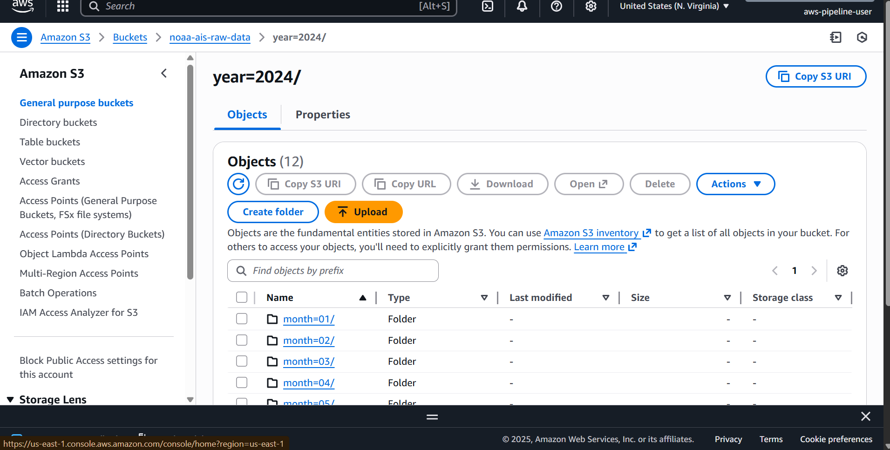
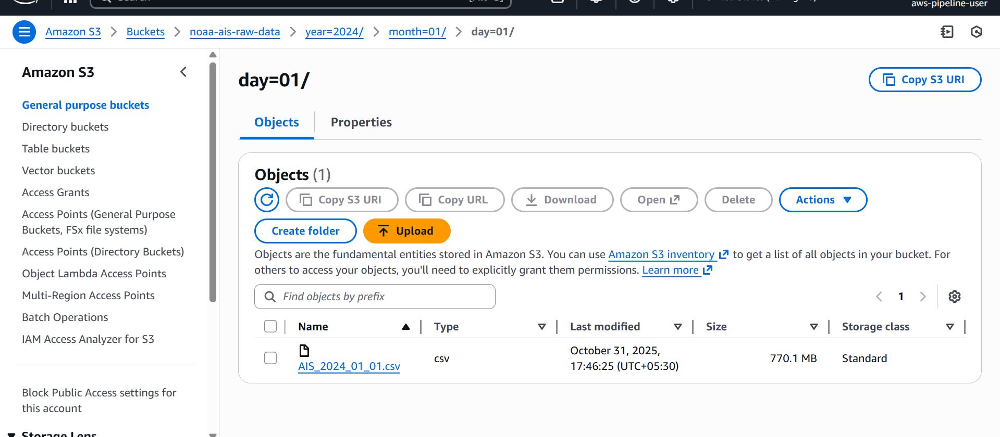

# **NOAA AIS Raw Data Ingestion**

This document describes the ingestion process for **NOAA AIS vessel tracking data** into Amazon S3.

The scripts automate the transfer of **2024 (.zip)** and **2025 (.zst)** daily AIS files directly from NOAA’s public data repository into your S3 bucket **without any local downloads**.

---

## **Overview**

Each script streams data directly:

```
NOAA public endpoint → AWS CloudShell → Amazon S3
```

No intermediate storage is used as the data is piped directly from the NOAA servers into your S3 bucket.

This approach avoids bandwidth and storage costs on your local machine and minimizes transfer time.

---

## **Files**

| File             | Description                                                                            |
| ---------------- | -------------------------------------------------------------------------------------- |
| `ingest_2024.sh` | Handles 2024 `.zip` AIS files from NOAA, unzips and streams to S3                      |
| `ingest_2025.sh` | Handles 2025 `.zst` AIS files, decompresses using Python `zstandard` and uploads to S3 |

Both scripts:

* Check if the file already exists in S3 (skip duplicates).
* Stream data directly with `wget`, `funzip` or `zstandard`.
* Automatically organize files by **year → month → day** in S3.

---

## **Setup Instructions**

Run these commands in **AWS CloudShell** (free environment).
Replace the bucket name as needed.

### **Step 1: Create an S3 Bucket**

```bash
aws s3api create-bucket \
  --bucket noaa-ais-raw-data \
  --region us-east-1 \
  --create-bucket-configuration LocationConstraint=us-east-1
```

### **Step 2: Create and Edit Scripts in CloudShell**

Open and create the ingestion scripts using `nano`:

```bash
nano ingest_2024.sh
```

Paste the script content, then:

* Press **Ctrl + O** → **Enter** to save.
* Press **Ctrl + X** to exit.

Repeat for 2025:

```bash
nano ingest_2025.sh
```

---

### **Step 3: Make Executable**

```bash
chmod +x ingest_2024.sh ingest_2025.sh
```

### **Step 4: Run the Scripts**

```bash
./ingest_2024.sh
./ingest_2025.sh
```

---

## **S3 Folder Structure**

```
s3://noaa-ais-raw-data/
├── year=2024/
│   ├── month=01/day=01/
│   ├── month=01/day=02/
│   └── ...
└── year=2025/
    ├── month=01/day=01/
    ├── month=01/day=02/
    └── ...
```

Each folder contains a single uncompressed `.csv` for that day’s AIS data.

---

## **S3 Partition Hierarchy**

The images below show how daily AIS files are stored and partitioned by `year`, `month`, and `day` in Amazon S3.

| Year | Month | Day |
|------|--------|-----|
|  |  |  |


## **Cost & Network Notes**

| Item                               | Cost                 | Notes                                          |
| ---------------------------------- | -------------------- | ---------------------------------------------- |
| **CloudShell compute**             | Free                 | Included with AWS account                      |
| **Data transfer (Internet → AWS)** | Free                 | AWS does not charge for inbound transfers      |
| **S3 upload (PUT requests)**       | Negligible           | ~$0.005 per 1,000 requests                     |
| **S3 storage**                     | ~$0.025 per GB/month | 455 GB ≈ **$11.38/month** total                |
| **Glue compute (later)**           | Charged separately   | Your main credit usage will come from ETL jobs |

---

## **Monitoring & Verification**

Check uploads:

```bash
aws s3 ls s3://noaa-ais-raw-data/year=2024/ --recursive --human-readable --summarize
```

Sample output:

```
Total Objects: 365
Total Size: 455.1 GB
```

You can monitor S3 bucket metrics via **AWS Console → S3 → Metrics tab**.

---

## **Notes**

* Each NOAA file may vary between **600 MB and 2 GB** depending on vessel activity.
* Total 2024 + 2025 data volume: ~**455 GB**.
* Ingestion uses streaming (no temporary disk usage).
* Automatically skips missing or invalid daily files.

---

© 2025 NOAA AIS Pipeline Project. All rights reserved.
