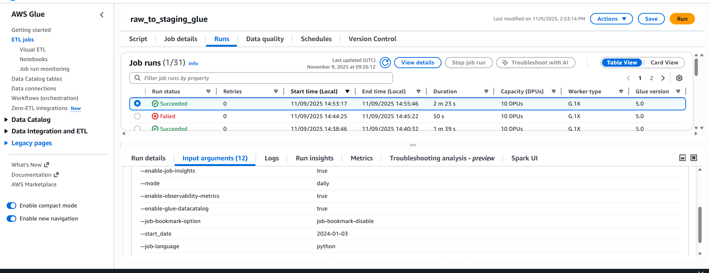
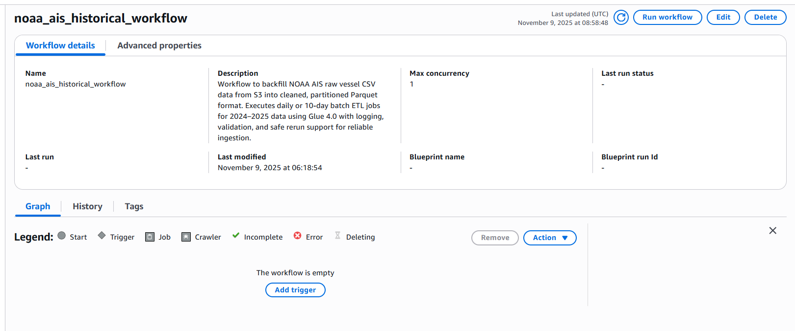
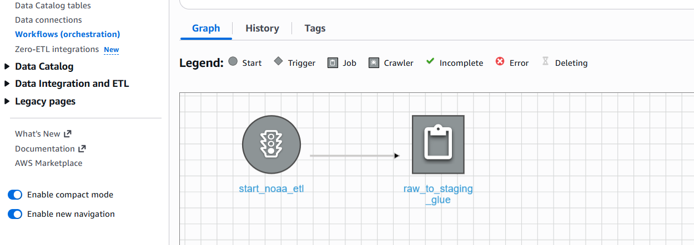
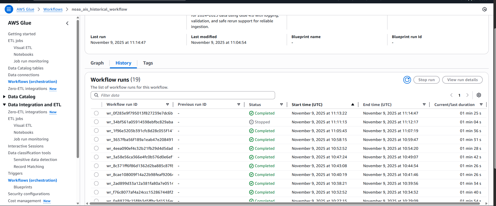
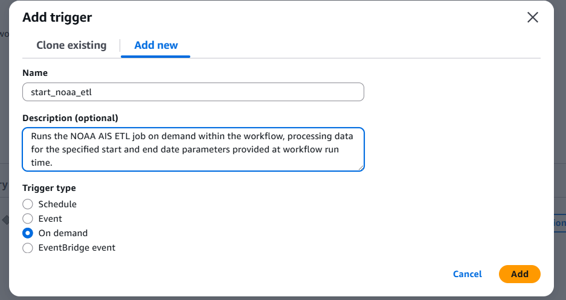
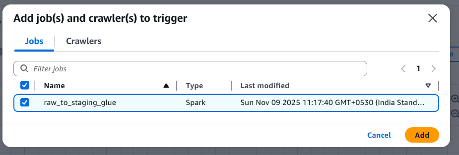
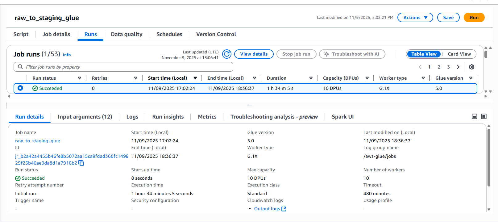

# AWS Glue Workflow Orchestration – NOAA AIS ETL

## 1. Objective

Automate the **NOAA AIS ETL Glue job** to process raw AIS data from S3 in defined date batches, leveraging AWS Glue Workflows for orchestration and execution tracking.

---

## 2. Components Created

### **Glue Job: `raw_to_staging_glue`**

* Type: Spark (Glue 4.0)

* Purpose: Transform raw AIS CSV data → cleaned, partitioned Parquet format.

* Parameters:

  | Key            | Example Value | Description                           |
  | -------------- | ------------- | ------------------------------------- |
  | `--mode`       | `daily`       | Defines job mode (`daily` or `full`). |
  | `--start_date` | `2024-01-01`  | Start of data range to process.       |
  | `--end_date`   | `2024-01-10`  | End of data range to process.         |

* Logs stored in `/tmp/logs/` within Glue runtime environment.

* Input: `s3a://noaa-ais-raw-data/year=*/month=*/day=*/`

* Output: `s3a://<your-staging-bucket>/cleaned/`

#### **Normal Glue Job Run Example:**



---

### **Glue Workflow: `noaa_ais_historical_workflow`**

* Purpose: Orchestrate batch ETL runs for historical data.
* Behavior: Executes a single Glue job per workflow run.
* Monitored in **AWS Glue Console → Workflows → Run Details**.
* Execution tracking includes:

  * Workflow run ID (`wr_xxxxx`)
  * Job execution logs
  * Completion status (Success/Failed)

#### **Workflow Creation (UI Steps):**




#### **Workflow Run Completion Example:**



---

### **Trigger: `start_noaa_etl`**

* Type: **Start trigger**
* Connected to workflow: `noaa_ais_historical_workflow`
* Linked job: `raw_to_staging_glue`
* Runs automatically when workflow is started.

#### **Trigger Configuration:**

| Field             | Value                                                                             |
| ----------------- | --------------------------------------------------------------------------------- |
| **Trigger type**  | Start                                                                             |
| **Workflow**      | noaa_ais_historical_workflow                                                      |
| **Action**        | raw_to_staging_glue                                                               |
| **Job arguments** | Uses the job’s own configured parameters (`--mode`, `--start_date`, `--end_date`) |

#### **Trigger Creation (UI Steps):**




---

## 3. Execution Flow

1. **Workflow Run**
   Manually start the workflow from the Glue console or via CLI:

   ```bash
   aws glue start-workflow-run --name noaa_ais_historical_workflow
   ```

2. **Trigger Activation**
   The trigger automatically invokes the `raw_to_staging_glue` job.
   Job runs using parameters already defined in its configuration.

3. **Job Execution**
   ETL script runs Spark transformations:

   * Reads raw data from S3
   * Cleans, deduplicates, and partitions data
   * Writes Parquet outputs by year/month/day

4. **Workflow Completion**
   The workflow marks success when the job finishes.
   View logs under **AWS Glue → Jobs → Runs → CloudWatch Logs**.

---

#### **One Year Backfill Job Runtime:**



## 4. CLI Reference

### **Start Workflow**

```bash
aws glue start-workflow-run --name noaa_ais_historical_workflow
```

### **Check Workflow Status**

```bash
aws glue get-workflow-run \
  --name noaa_ais_historical_workflow \
  --run-id <run-id> \
  --query 'Run.Status'
```

### **List Workflow Runs**

```bash
aws glue get-workflow-runs --name noaa_ais_historical_workflow
```

---

## 5. Key Notes

* The Glue **workflow run** uses **job’s own parameters** unless overridden by CLI or API.
* Trigger type = `Start` ensures job runs immediately when workflow starts.
* CloudWatch retains detailed Spark execution logs for monitoring.
* Manual workflow runs simplify control — one workflow per date range.

---

## 6. Future Enhancements

1. Add **Lambda trigger** to start next workflow batch automatically.
2. Integrate **SNS notifications** for job completion/failure.
3. Parameterize `start_date` and `end_date` dynamically through boto3 or event-based input.
