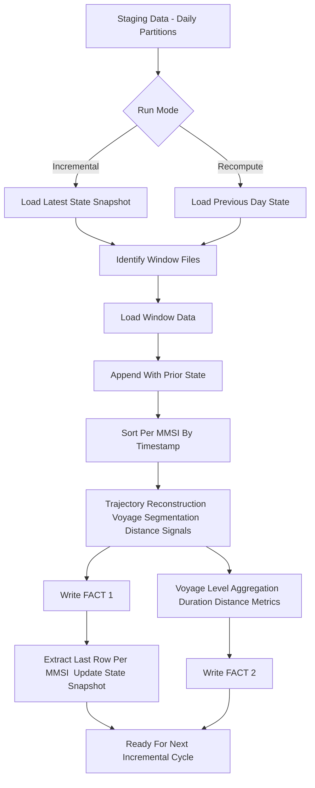

# AIS Incremental Processing and Voyage Recompute Model

This document captures the full set of concepts, edge cases, and control-flow logic required to support incremental AIS ETL processing from raw/staging data into curated facts. The focus is understanding *why* incremental state is needed, *how* voyage segmentation depends on history, and *how* to safely recompute when past data is corrected.

---

# 1. Core Problem

AIS data is **time-ordered**, **vessel-specific**, and **stateful**. A vessel’s voyage segmentation depends on:

* previous timestamp
* previous coordinates
* previous voyage_id counter

Therefore:

* **Today’s output depends on yesterday’s data**.
* Simply processing one day independently produces wrong voyage segmentation.

This dependency requires:

* A **state store** holding the last known point of each MMSI.
* A **controlled incremental or recompute path**.

---

# 2. Key Concepts

## 2.1 Stateful Sliding Window

To compute voyage segmentation for day *D*, we must read the last row of day *D-1* per MMSI:

* last timestamp
* last lat/lon
* last voyage_id

This allows detection of cross-day gaps > 3 hrs.

## 2.2 Voyage Segmentation Rule

```
if (current_ts - prev_ts) > 3 hours:
    voyage_id += 1
else:
    same voyage
```

This rule applies continuously over all days.

## 2.3 Haversine Distance

Distance between consecutive AIS points is cumulative across days.

## 2.4 State Snapshot

After each run, we persist **1 row per MMSI**:

```
MMSI
last_timestamp
last_lat
last_lon
last_voyage_id
```

This is stored in curated/state/by_date=YYYY-MM-DD/.

---

# 3. Incremental Workflow

This workflow processes only *new* days, extending from the last processed date.

### Flow

1. Load state snapshot (last processed point for each MMSI).
2. Load staging data for new days.
3. Union state + new data.
4. Sort per MMSI.
5. Recompute voyage logic **only from the first new day** onward using state as seed.
6. Write curated Fact 1 and Fact 2 for new days (window-scoped overwrite by date/mmsi).
7. Update state snapshot to dated folder(s) for the window.



### Pseudocode

```
state = read_state()
new = read_staging(start_date..end_date)
input = union(state, new)
sorted = sort_by(MMSI, BaseDateTime)
segmented = compute_voyage_id(sorted)
curated = segmented where date>=start_date
write_fact(curated)
write_state(final_segmented)
```

---

# 4. Recompute Workflow (Correction Mode)

Used when older data is discovered to be incorrect. Requires reprocessing from that point.

### Example

* Existing state snapshot is at 260th day.
* Day 200 file is corrupted.
* Need to recompute from day 200 to day 260.

### Flow

1. Identify **boundary day** (start_date).
2. Load state snapshot for the day before start_date.
3. Load staging data from start_date..end_date.
4. Discard all curated data for that date window.
5. Recompute segmentation, distance, geohash.
6. Rewrite curated outputs for that window (partition-aware replace).
7. Update state snapshot for end_date under by_date.

### Pseudocode

```
state = read_state(day_before_start_date)
bad_window = read_staging(start_date..end_date)
input = union(state, bad_window)
sorted = sort_by(MMSI, BaseDateTime)
segmented = recompute segmentation
overwrite curated partitions for start_date..end_date
write new state snapshot
```

---

# 5. Why State is Mandatory

Without last-known-point, day boundaries break:

* voyages split incorrectly
* distance resets
* average speed becomes wrong
* duration resets every midnight

### Example

Day1 last point: 00:00 Day2 first point: 00:10 If we do not import day1’s last row into day2 run:

```
prev_ts=None -> voyage_id=0
```

But correct is:

```
prev_ts=00:00 -> gap=10min -> same voyage_id
```

---

# 6. Edge Cases

## 6.1 Missing Days in Staging

If day 12 is missing:

* next day will treat gap as > 3 hrs
* voyage ends artificially Solution: only treat >3h gap triggered by *actual timestamps*, not daily boundaries.

## 6.2 Late-arriving MMSI Not in State

If MMSI is not in state:

* treat as new vessel
* voyage_id starts at 0

## 6.3 Negative or duplicate timestamps

Sorting ensures deterministic voyage splits.

## 6.4 Wrong input day removed/rewritten

Recompute mode must always overwrite curated partitions.

---

# 7. Partitioning Strategy

## Fact 1 (trajectory_points)

Partitioned by:

```
year=YYYY/month=MM/day=DD/mmsi=NNNNNNNNN/
```

Only the window being written is replaced (replaceWhere).

## Fact 2 (voyage_summary)

Small table; written coalesced without partitions.

---

# 8. What We Tested in Notebook

The following functions were validated end-to-end on 4 days:

* segment_voyages
* haversine calculation
* movement state
* geohash
* voyage start/end
* total distance aggregation
* duration hours
* average speed

This confirms all curated logic.

---

# 9. Recommended Modes

## Mode A: Normal Incremental

```
--mode incremental
--start_date today
--end_date today
```

Processes only new daily data.

## Mode B: Recompute Window

```
--mode recompute
--start_date wrong_day
--end_date latest_day
```

This rebuilds curated facts for the specific corrupted window.

---

# 10. Summary of Key Learnings

* Voyage segmentation is inherently stateful.
* Incremental ETL must carry state across days.
* Curated facts must be overwritten for recompute windows.
* State snapshot ensures continuity when processing next day.
* Recompute mode is mandatory for corrections.
* Fact 1 depends on raw+state; Fact 2 depends only on Fact 1.

---

# 11. Final High-Level Flow Diagram

```
STAGING ---> [SORT] --> [SEGMENT] --> [DISTANCE] --> [GEOHASH] --> FACT 1
                                                        |
                                                        v
                                                  FACT 2 (Aggregate)
                                                        |
                                                        v
                                                 STATE SNAPSHOT
```

This closes the loop for the next incremental run.

---

# 12. Additional Notes on Curated Partitioning vs Staging Partitioning

## 12.1 Why Staging is Partitioned by Date

Staging holds cleaned inputs and supports selective reprocessing of specific days. Partitioning by `year/month/day` enables efficient pruning when rerunning only certain dates.

## 12.2 Curated Partitioning Choice

trajectory_points is partitioned by date (year/month/day); mmsi is clustered via repartition for window-scoped overwrite and pruning. Rows are sampled (keep endpoints, moving fast/slow cadence by SOG, sparse anchored points). voyage_summary is small and written coalesced without partitions.

## 12.3 Incremental Boundary Detection

The pipeline uses state tables (by_date snapshots), not curated partition folders, to track last processed event per MMSI. This ensures continuity even if curated is thin/partitioned.

## 12.4 Concepts Used in Incremental Logic

* Stateful sliding window per MMSI
* Distributed sorting per entity
* Time-gap based segmentation
* Stateful voyage-id propagation
* Haversine distance accumulation across days
* Geo-spatial hashing for map joins
* MapReduce-style aggregations for voyage summaries
* State snapshotting for incremental resume (by_date snapshots only)
* Recompute window overwrite logic for corrections

---

# 13. Sampling Strategy (trajectory_points)

To control volume while keeping paths:

* Keep all day/voyage endpoints.
* Moving points: fast cadence when SOG >= threshold, slower cadence otherwise.
* Anchored points: sparse cadence (first/last per bucket).
* Recompute segment distances on the sampled set.

Sampled output is partitioned by year/month/day/mmsi; replaceWhere limits overwrite to the run window.

# 14. Grain, Fidelity, and Rationale

* AIS emits frequent GPS pings (seconds to minutes); anchored vessels generate many low-value pings with small jitter.
* trajectory_points grain: one row per MMSI/voyage/timestamp after sampling. We retain endpoints and a cadence-based sample (fast/slow by SOG, sparse anchors) to preserve routes while cutting size.
* voyage_summary grain: one row per MMSI/voyage with start/end/distance/duration/avg speed/centroid; no partitioning needed due to small size.
* Partitioning: trajectory_points uses year/month/day/mmsi so each run overwrites only its window; voyage_summary is written coalesced.
* State: stored per-date only (by_date=YYYY-MM-DD) to seed cross-day continuity; no latest overwrite.
* Why sample from ~4.5B raw points: reduce S3/storage/query cost and small-file overhead while keeping path fidelity for analytics (endpoints kept; moving sampled; anchors sparse).

End of Document.
