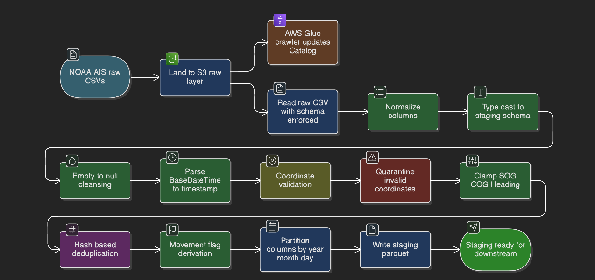
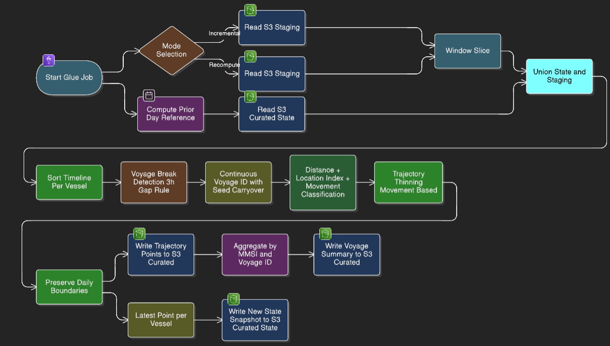
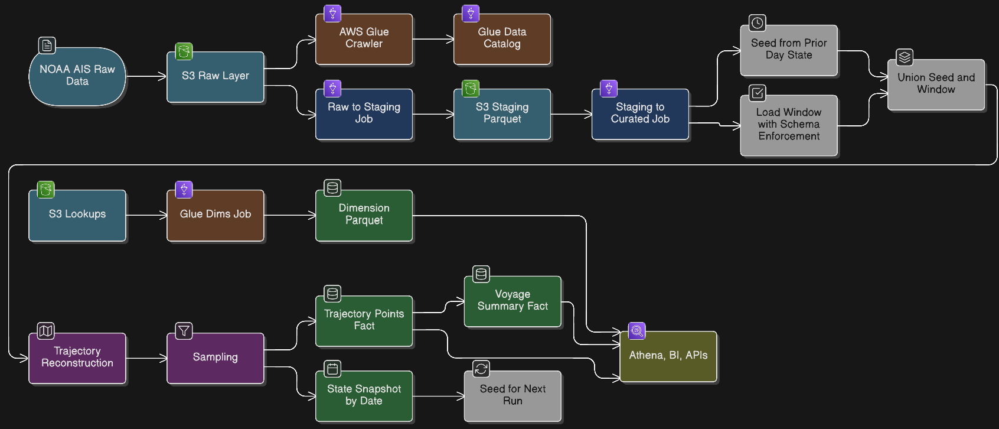

# Detailed Architecture and Flows

This file capture, step-by-step flows for the NOAA AIS pipeline, covering raw -> staging, staging -> curated (Facts 1 & 2 with state), and the end-to-end architecture including dimensions and consumption.

---

## Raw -> Staging (detailed)

Steps:
- Ingest NOAA AIS daily drops via CloudShell scripts directly into `s3://.../raw/year=YYYY/month=MM/day=DD/`
- Trigger Glue `raw_to_staging` job for the date window; read raw CSV with schema normalization and column mapping
- Validate lat/lon/SOG/COG/Heading; quarantine invalid rows; enforce types and null handling
- Deduplicate with a content hash to drop replays; partition by `year/month/day`
- Write cleaned Parquet to `s3://.../staging/year=YYYY/month=MM/day=DD/`; log row/quality metrics to CloudWatch

---

## Staging -> Curated (Fact 1 & Fact 2, detailed)

Steps:
- Read staging partitions for the target dates with enforced schema.
- Derive movement_state, apply 3h-gap voyage segmentation, bucket timestamps, sample timeline, recompute segment distances.
- Build Fact 1 (trajectory) and Fact 2 (voyage summary) with geohash and aggregates; attach partition columns.
- Write curated Parquet to `.../trajectory_points/year=YYYY/month=MM/day=DD/`; write trajectory state snapshots for continuity.
- Aggregate voyages for the window and write voyage summary partitioned by `VoyageStartDate`.

Behavior:
- Trajectory (Fact 1): writes `trajectory_points/year=YYYY/month=MM/day=DD/`; `replaceWhere` overwrites only window dates; trajectory state snapshots live under `trajectory_state/by_date=YYYY-MM-DD/`.
- Voyage summary (Fact 2): reads only window partitions (`year=YYYY/month=MM/day=DD`); seeds from prior-day voyage state snapshot `voyage_state/by_date={start_date - 1 day}/`; merges deltas and writes `voyage_state/by_date={end_date}/`; writes `voyage_summary/` partitioned by `VoyageStartDate` with dynamic overwrite of touched partitions.
- Orchestrator flags: `run_fact1`/`run_fact2` control skipping facts (default on); `LOG_COUNTS=1` turns on checkpoint counts.
- Config paths: trajectory state prefix `trajectory_state/`; voyage state prefix `voyage_state/by_date=`.

## Runbook: running and rerunning facts

| Scenario                            | What to run                          | Notes                                                                                         |
|-------------------------------------|--------------------------------------|-----------------------------------------------------------------------------------------------|
| Normal daily/window run             | Glue job `staging_to_curated`        | Runs Fact 1 + Fact 2 for `start_date`..`end_date` in incremental mode.                        |
| Rerun Fact 2 only (window)          | Glue job `staging_to_curated` with `--run_fact1=0 --run_fact2=1` | Uses existing `trajectory_points` partitions for the window; updates `voyage_state/by_date=`, upserts `voyage_summary`. Ensure trajectory data for the window is correct. |
| Rerun Fact 1 (and Fact 2) for window| Glue job `staging_to_curated` with `mode=incremental` and the window | Use when trajectory output is wrong for that window; Fact 2 will refresh touched voyages.     |
| Full recompute (backfill)           | Glue job `staging_to_curated` with broad window and `mode=recompute` | Rebuilds trajectory, voyage summary, and state; use larger cluster.                          |

Key behaviors (current code):
- Fact 2 reads only the window’s `trajectory_points` partitions and uses a voyage state table to incrementally upsert summaries.
- Voyage summary is partitioned by `VoyageStartDate`; dynamic overwrite keeps writes scoped to touched partitions.
- Voyage state is stored as dated snapshots under `voyage_state/by_date=YYYY-MM-DD/` (no separate latest path). Trajectory state snapshots live under `trajectory_state/by_date=YYYY-MM-DD/`.
- If Fact 2 fails or changes, rerun Fact 2 alone for the affected window(s) with `run_fact1=0 run_fact2=1` when trajectory data is already correct. Only rerun Fact 1 when trajectory data is wrong or Fact 1 logic changed.

Fact 2-only flags (same Glue job):
- `--run_fact1=0 --run_fact2=1`
- `--start_date YYYY-MM-DD`
- `--end_date YYYY-MM-DD`

---

## End-to-End Architecture (raw -> staging -> curated + dims + consumption)

Steps:
- Ingest raw AIS to S3 (raw layer), then cleanse/dedup into staging via Glue job 1
- Transform staging to curated facts with state-aware incremental logic via Glue job 2
- Load dimensions (country/MID, nav status, vessel type) from lookup files into curated dims via Glue job 3
- Register Athena external tables/views over curated facts and dims; serve Power BI/GeoJSON/API queries
- Monitor via CloudWatch logs/metrics; rerun recompute mode for backfills; archive cold raw data to Glacier as needed
