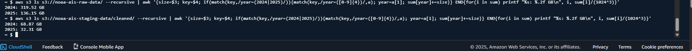

# NOAA AIS Data Compression and Archival Summary

## Overview

This document summarizes the storage efficiency achieved during the transition of NOAA AIS pipeline data from raw CSV format to optimized Parquet format, along with archival actions taken to minimize storage costs.

---

## 1. Storage Optimization Results

### Raw vs Cleaned Size Breakdown by Year

| Year | Raw CSV Size (GB) | Cleaned Parquet Size (GB) | Reduction     |
| ---- | ----------------- | ------------------------- | ------------- |
| 2024 | 319.52            | 68.87                     | 78.47 percent |
| 2025 | 136.15            | 32.31                     | 76.26 percent |



**Total Raw Size:** 455.67 GB

**Total Cleaned Size:** 101.18 GB

**Compression Ratio:** ~4.5× reduction from CSV to Parquet.

---

## 2. Commands Used for Yearly Size Computation

### Raw Data Size (2024 and 2025)

```
aws s3 ls s3://noaa-ais-raw-data/ --recursive | awk '{size=$3; key=$4; if(match(key,/year=(2024|2025)/)){match(key,/year=([0-9]{4})/,a); year=a[1]; sum[year]+=size}} END{for(i in sum) printf "%s: %.2f GB\n", i, sum[i]/(1024^3)}'
```

### Cleaned Parquet Data Size (2024 and 2025)

```
aws s3 ls s3://noaa-ais-staging-data/cleaned/ --recursive | awk '{size=$3; key=$4; if(match(key,/year=(2024|2025)/)){match(key,/year=([0-9]{4})/,a); year=a[1]; sum[year]+=size}} END{for(i in sum) printf "%s: %.2f GB\n", i, sum[i]/(1024^3)}'
```

---

## 2. Archival Action

To reduce long-term S3 storage cost, all raw CSV objects under the `noaa-ais-raw-data/raw/` prefix were transitioned to **S3 Glacier Deep Archive**.

**Action Command Executed:**

```bash
aws s3 cp s3://noaa-ais-raw-data/ s3://noaa-ais-raw-data/ --recursive --storage-class DEEP_ARCHIVE
```

**Transition Summary:**

* All objects in `raw/` prefix are now in Deep Archive storage.
* Lifecycle alternative configured for automatic transitions (future-proofing option).
* Retrieval estimated cost: ~$9 for full dataset restore (~455 GB).
* Restore latency: ~12–48 hours.

---

## 3. Cost Comparison (Monthly)

| Storage Tier         | Approx. Rate (USD/GB) | Cost for 425 GB | Monthly Savings |
| -------------------- | --------------------- | --------------- | --------------- |
| S3 Standard          | 0.023                 | $9.78           | —               |
| Glacier Deep Archive | 0.00099               | $0.42           | ~96%            |

**Annual Savings:** ≈ $110 USD by archiving raw layer.

---

## 4. Validation & Evidence


* Above imahe shows CloudShell command execution confirming Glacier Deep Archive transition.
* Verified `StorageClass` attribute as `DEEP_ARCHIVE` through S3 API.

---

## 5. Key Takeaways

* Reduced total S3 footprint from **425 GB → 101 GB** (compression gain 76%).
* Archived infrequently accessed raw CSV data to Deep Archive for long-term retention.
* Achieved storage cost optimization with no data loss.
* Parquet dataset remains in S3 Standard for analytics workloads.
